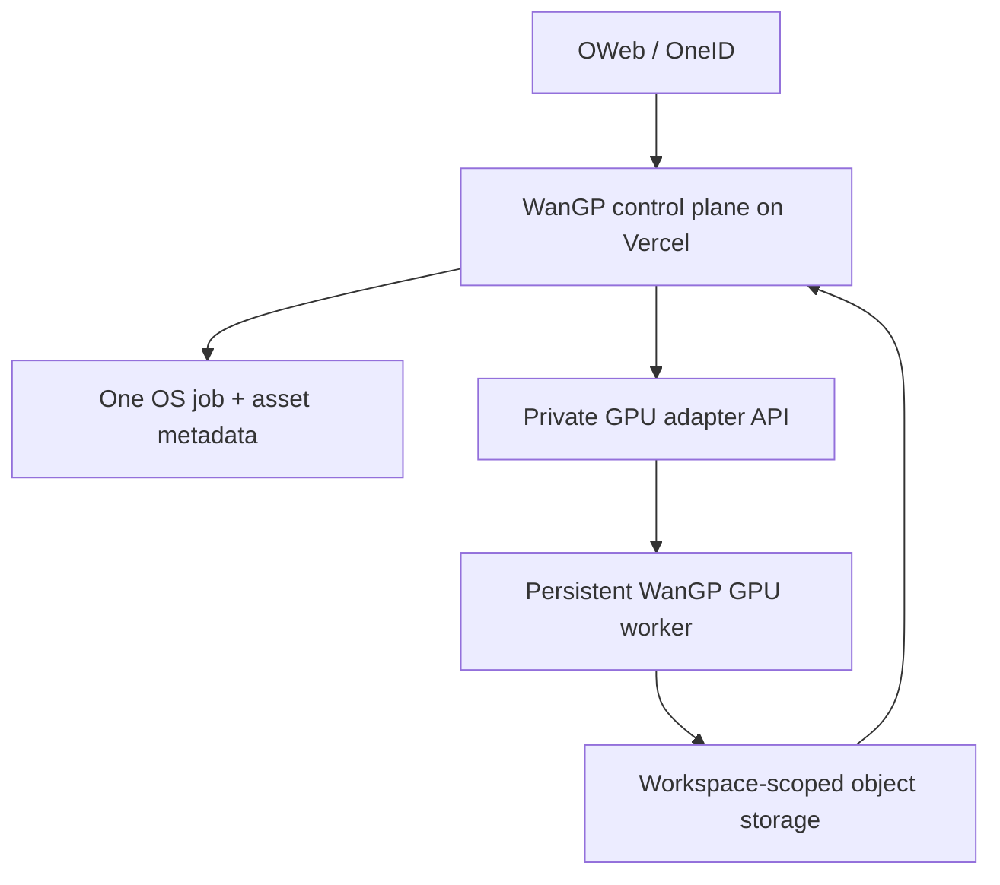

# OWeb Satellite Adapter — License-Gated Implementation Specification

> Status: architecture and adapter specification only. This document does **not** authorize a hosted WanGP deployment.

## Upstream and legal boundary

- Upstream: https://github.com/DeepBeepMeep/Wan2GP
- Product name: WanGP
- Upstream commit assessed: `6479db36bdc2619a904a852bba9c2d78e1a83f82` (2026-10-07)
- Governing upstream file: `LICENSE.txt` — **WanGP Community License 2.0**

The proposed OWeb satellite is workspace-scoped and designed to run as part of OWeb's paid platform. That is Restricted Commercialization under the upstream license: it is a paid platform/hosted integration and makes WanGP a material feature or monetized backend. It cannot be deployed, made available to end users, white-labeled, or offered through OWeb until OneWeb receives a separate **written reseller or commercial license** from the Licensor (DeepBeepMeep; contact in upstream license).

A source fork and this documentation are retained under the license's Free Use/redistribution provisions. The fork must preserve `LICENSE.txt`, upstream attribution, and bundled third-party notices. Every selected model, weight, dataset, and bundled dependency also requires its own license review before production.

## Satellite identity

| Field | Value |
| --- | --- |
| OWeb app id | `wangp` |
| Display name | WanGP |
| Activation scope | `workspace` |
| Identity/data plane | OneID / One OS |
| App table prefix | `wangp_` |
| Control plane | OWeb |
| GPU runtime | persistent GPU infrastructure, not Vercel |
| Initial release state | blocked pending upstream commercial license |

Do not create a second identity, workspace, Stripe entitlement, or browser-held GPU credential.

## Existing WanGP capabilities to reuse

The upstream is a Python/Gradio GPU application started by `wgp.py`. Reuse its in-process Python interface rather than attempting to recreate inference logic:

- `shared/api.py` exposes `WanGPSession`, task submission, cancellation, results, generated files, and structured progress/preview/status/output/completion events.
- The API can target direct headless execution or WanGP's existing live Gradio WebUI queue. Keep the loaded model alive across requests where safe.
- `python wgp.py --process <queue.zip>` provides existing headless saved-queue processing.
- `shared/mcp_server.py` exposes MCP API v2; do not expose it publicly by default.
- The native gallery and normal output paths are used by the Python API; a hosted adapter must mirror only verified completed artifacts into workspace-scoped storage.
- Model metadata, model definitions, LoRA paths/mapping, preprocessing and post-processing already exist upstream.
- The plugin system, Deepy, remote LLM connectors, and model manager are privileged runtime capabilities. They must be disabled or allowlisted in a multi-tenant deployment unless separately reviewed.

Upstream's Dockerfile is an NVIDIA CUDA container (currently CUDA 12.8.1 / cuDNN / Ubuntu 22.04). It compiles/installs GPU-specific dependencies and persists downloaded models, LoRAs, and generated files. The image belongs on persistent GPU infrastructure with mounted persistent model/cache volumes; it is not a Vercel workload.

## Target architecture after written permission

### Control plane (Vercel)

- Product shell is authenticated against One OS. Native `/login` uses the shared Supabase Auth project and the same credentials as OWeb.
- `Continue with OWeb` links to `https://oweb.one/login?launch=wangp`.
- `/sso?launch_token=...` redeems server-side through `POST https://oweb.one/api/v1/ecosystem/redeem-launch-token` with `{ launch_token, app_id: "wangp" }`, then establishes the shared user session. Never place the One OS service-role key in the satellite.
- On each first session, the server records app activation; on each first workspace context, it records workspace activation.
- The active workspace is resolved server-side from One OS membership, activation, and grants. Client-provided workspace ids are never trusted.
- A non-owner/admin workspace member requires the current OWeb app-grant rule; a resource invitation must not unlock the satellite.
- Job submission creates a durable `wangp_jobs` row before it calls the GPU adapter. Browser clients receive only opaque job ids and signed asset URLs.

### One OS data model

All persisted app data must be workspace-owned, RLS-protected, and namespaced:

| Table | Purpose |
| --- | --- |
| `wangp_profiles` | idempotent local projection keyed by `auth.users.id`; no second identity |
| `wangp_jobs` | request, canonical `workspace_id`, status, model configuration digest, runtime handle, timestamps |
| `wangp_job_events` | normalized progress/status events; no secrets or raw credentials |
| `wangp_assets` | workspace-owned input/output artifacts, storage key, MIME type, lineage |
| `wangp_generations` | durable history linked to job and produced assets |
| `wangp_workspace_settings` | workspace policy, approved models, retention; no provider secrets |

Use RLS and server authorization together. Every job, event, generation, and asset must be directly or unambiguously related to its canonical `workspace_id`.

### GPU adapter

Run a small private FastAPI-style adapter next to the persistent WanGP process. It should:

1. Validate a short-lived, audience-bound server-to-server credential from the Vercel control plane.
2. Receive only a previously-authorized job id, workspace id, configuration, and signed input references.
3. Enforce an application-side dispatcher so the upstream process's global Gradio queue never leaks a job, event, gallery path, or artifact across workspaces.
4. Map the request into `WanGPSession.submit_task(...)` / supported WebUI queue mode, and stream normalized events to the control plane.
5. On completion, verify the generated files, copy them to the workspace-scoped storage prefix, and report only durable asset ids/metadata.
6. Support cancellation through `SessionJob.cancel()`.
7. Never accept One OS service keys, Vercel credentials, GPU-provider credentials, or arbitrary local file paths from the browser.

Use private networking, mTLS or signed request JWTs with short expiry and replay protection, and an egress allowlist. Store GPU provider credentials only in the GPU runtime secret manager. User-owned/BYOK credentials, if later enabled, must be encrypted server-side per workspace and never returned to a browser or logged.

### Storage and model policy

- Inputs: browser uploads directly to a workspace prefix using short-lived signed URLs.
- Outputs: adapter writes/returns only a workspace prefix; Vercel exposes short-lived read URLs after server authorization.
- Native WanGP output/gallery paths are scratch space, not the source of access control.
- Model weights and shared approved LoRAs are runtime-managed and versioned. Workspace-uploaded LoRAs require malware/license/size review and must not become globally visible.
- Do not automatically install plugins, models, Python packages, or arbitrary LoRAs from user input.
- Deepy remote-provider features and external MCP tools remain disabled until each provider, data handling path, and secret boundary is reviewed.

## Required implementation sequence after permission

1. Obtain a written reseller/commercial license covering paid hosted/workspace SaaS, embedded OWeb use, and API/headless GPU execution.
2. Confirm every enabled model/weight/dataset allows the selected commercial hosted use.
3. Implement the Vercel control plane, OneID login, SSO token redemption, workspace resolution, activation, and RLS migrations.
4. Implement the private GPU adapter and a production GPU deployment with persistent model/cache/output volumes.
5. Register `wangp` in OWeb as `beta` only when an actual non-production preview can perform a real authenticated generation.
6. Verify native login, OWeb SSO, app/workspace activation, cross-workspace denial, app grants, invalid-token handling, job cancellation, and output isolation.
7. Run a real generation through the persistent GPU backend and verify the asset is returned only to the submitting workspace.
8. Run dependency/security checks, deployment/runtime checks, and browser smoke tests; mark `live` only after all pass.

## Explicit non-goals before permission

- No OWeb-hosted WanGP service
- No production/preview GPU runtime
- No Vercel project that serves the WanGP product
- No deployment, beta launch, end-user generation, or OneCredits/billing entitlement
- No removal or alteration of upstream attribution/license notices
